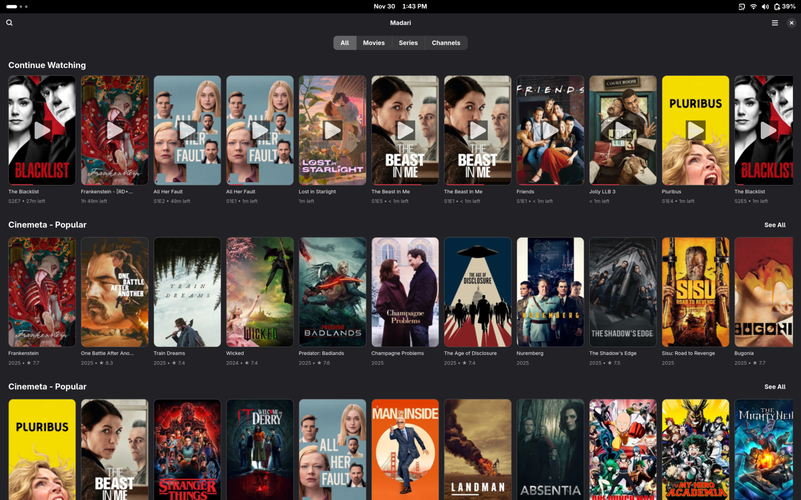
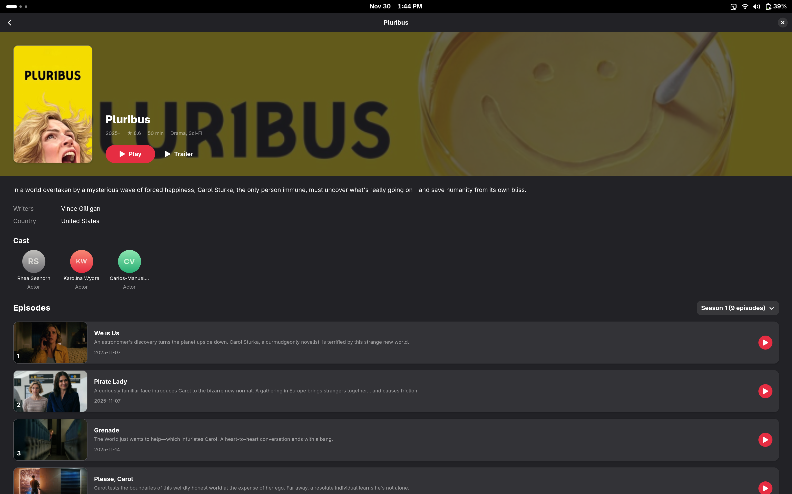
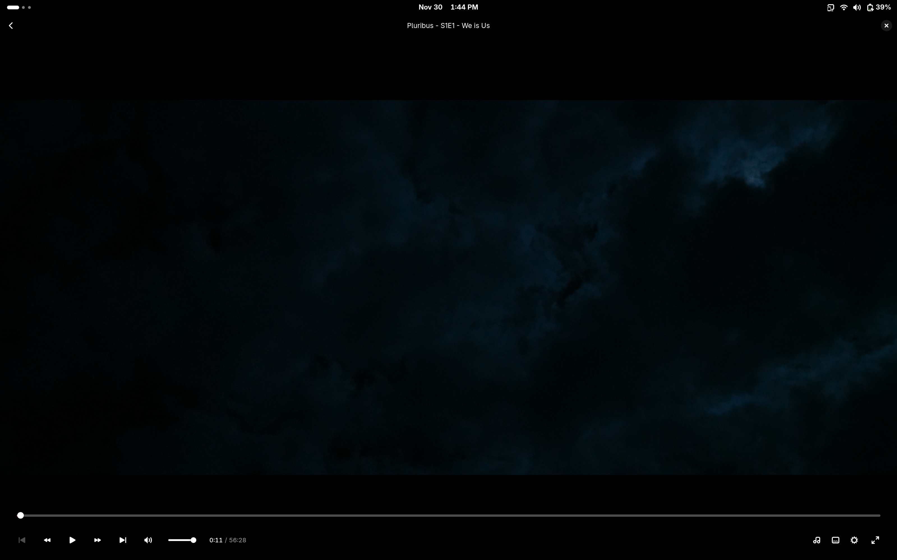

<p align="center">
  
</p>

<h1 align="center">Madari</h1>

<p align="center">
  <strong>A modern GTK4 media application with Stremio addon support</strong>
</p>

<p align="center">
  <a href="https://github.com/madari-media/madari-gtk/releases">
    
  </a>
  <a href="https://github.com/madari-media/madari-gtk/blob/main/LICENSE">
    
  </a>
</p>

---

## Screenshots

<p align="center">
  
</p>

<p align="center">
  
</p>

<p align="center">
  
</p>

## Features

- 🎨 **Modern UI** - Built with GTK4 and libadwaita for a beautiful, native Linux experience
- 📺 **Stremio Addon Support** - Browse and stream content from your favorite Stremio addons
- 📊 **Trakt Integration** - Sync your watch history and track your progress
- 🎬 **MPV-Powered Playback** - High-quality video playback with hardware acceleration
- 🔄 **Continue Watching** - Resume where you left off across all your content

## Installation

### Flatpak (Recommended)

```bash
# Coming soon
flatpak install media.madari.app
```

### AppImage

Download the latest AppImage from the [Releases](https://github.com/madari-media/madari-gtk/releases) page.

```bash
chmod +x madari-*.AppImage
./madari-*.AppImage
```

### Fedora / RHEL / CentOS

Download the RPM package from [Releases](https://github.com/madari-media/madari-gtk/releases):

```bash
sudo dnf install madari-*.rpm
```

### Debian / Ubuntu

Download the DEB package from [Releases](https://github.com/madari-media/madari-gtk/releases):

```bash
sudo apt install ./madari-*.deb
```

### Arch Linux

Download the package from [Releases](https://github.com/madari-media/madari-gtk/releases):

```bash
sudo pacman -U madari-*.pkg.tar.zst
```

### Building from Source

#### Dependencies

- meson >= 1.0.0
- ninja
- gtk4 >= 4.10
- libadwaita >= 1.4
- json-glib
- libsoup3
- mpv
- libepoxy

#### Build Instructions

```bash
# Clone the repository
git clone https://github.com/madari-media/madari-gtk.git
cd madari-gtk

# Build
meson setup build --prefix=/usr --buildtype=release
meson compile -C build

# Install (optional)
sudo meson install -C build
```

## Contributing

Contributions are welcome! Please feel free to submit a Pull Request.

## License

This project is licensed under the Apache License 2.0 - see the [LICENSE](LICENSE) file for details.

## Acknowledgments

- [Stremio](https://www.stremio.com/) for the addon ecosystem
- [mpv](https://mpv.io/) for the excellent media player
- [GTK](https://gtk.org/) and [libadwaita](https://gnome.pages.gitlab.gnome.org/libadwaita/) for the UI toolkit
